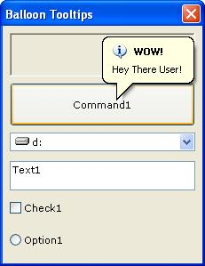



## Balloon Tool Tips Advanced

### Description

Features:

1)Set Its Title

2) Set Its Style, Square or balloon

3) Set Weather its centerd

4) Set its title - if u dont have a title it Uses A Small ToolTip, With No Title

5) Set its icon - If You Dont USe a icon, it dosent put a icon there

6) Set Backcolour

7) Set Forecolour

I Spent A Week Researching This Just For PSC so plz comment or vot =).
 
### More Info
 
You Will Need TO Put A ManiFest FIle On This TO Work. & You Will Find Another Sub in there i dint have time to do a example of. Its kool, use it with a textbox :).

Popup Balloon

             |
---                |---
**Submitted On**   |2002-08-10 20:19:56
**By**             |[Christopher Hemple](https://github.com/Planet-Source-Code/PSCIndex/blob/master/ByAuthor/christopher-hemple.md)
**Level**          |Advanced
**User Rating**    |3.9 (35 globes from 9 users)
**Compatibility**  |VB 3\.0, VB 4\.0 \(16\-bit\), VB 4\.0 \(32\-bit\), VB 5\.0, VB 6\.0
**Category**       |[Windows API Call/ Explanation](https://github.com/Planet-Source-Code/PSCIndex/blob/master/ByCategory/windows-api-call-explanation__1-39.md)
**World**          |[Visual Basic](https://github.com/Planet-Source-Code/PSCIndex/blob/master/ByWorld/visual-basic.md)
**Archive File**   |[Balloon\_To1167598102002\.zip](https://github.com/Planet-Source-Code/christopher-hemple-balloon-tool-tips-advanced__1-37823/archive/master.zip)

### API Declarations

In The Code.

